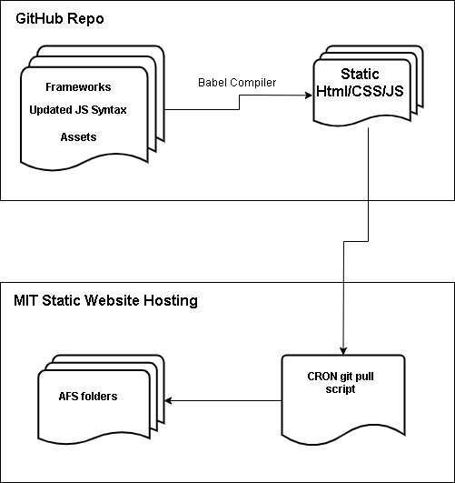

# General TDC Website (General Deploy)

## Intent and Delivery of Quick Deploy Iteration
This repo will be the central location for the tdc website so that we can more quickly deploy updates to the website.The deployment 
strategy will be to use github as a central location to have people make incremental changes in PRs and have an automated script 
pulling from this repo's master branch and populating our afs locker's static assets:

 
